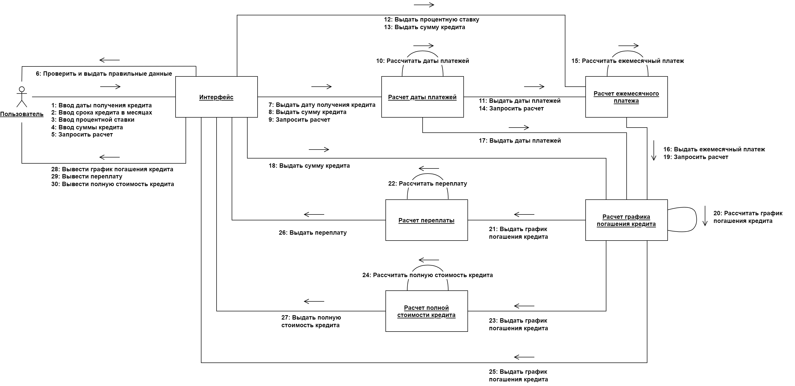
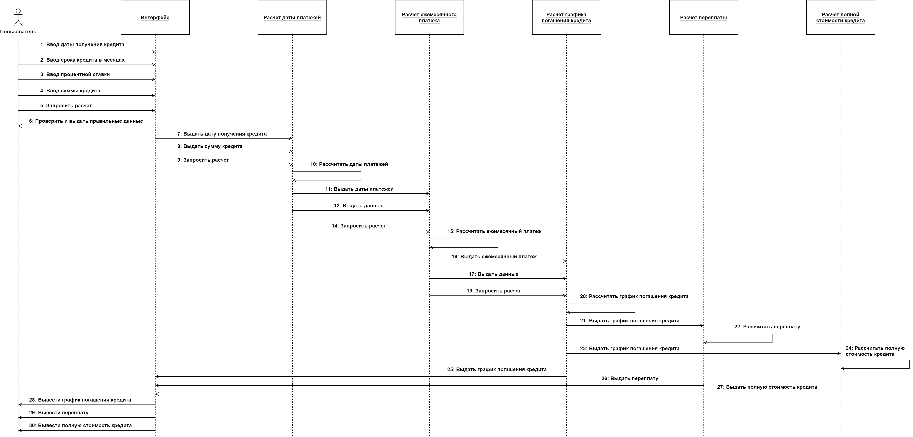
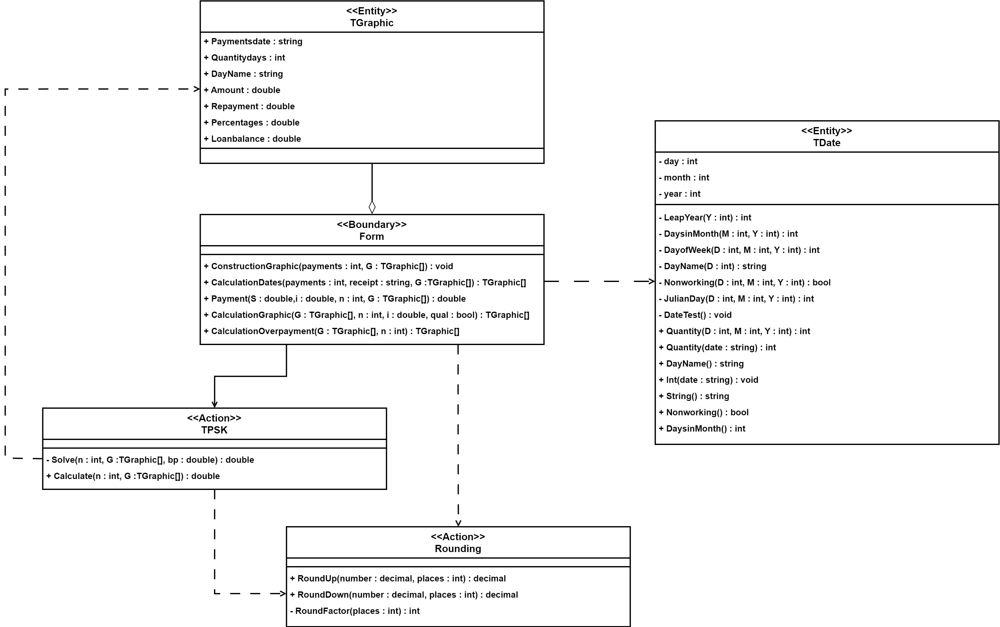
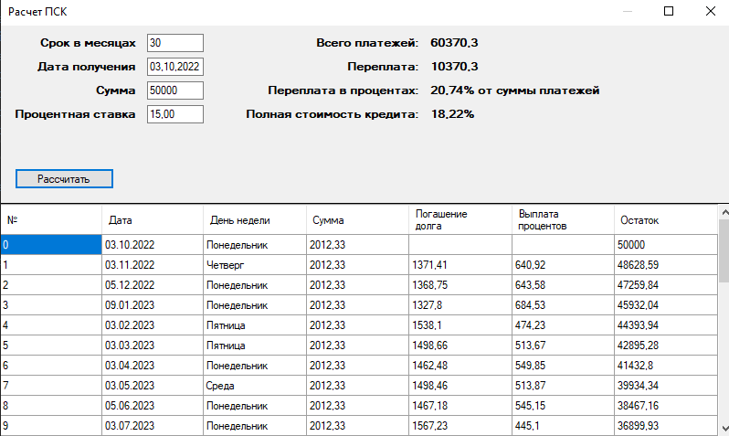

# Credit Total Cost

## Contents
- [Description](#русский)
- [Project structure](#структура-проекта--project-structure)
- [Features](#features--возможности)
- [Installation](#installation--установка)
- [Usage](#usage--использование)
- [Technologies](#technologies--технологии)
- [Application structure](#application-structure--структура-приложения)
- [License](#license)

### Русский
Приложение для расчета полной стоимости аннуитетного кредита с переменным платежным периодом, в соответствии с указаниями ЦБ РФ.

Полная стоимость кредита (ПСК) используется для оценки затрат, связанных с получением кредита, и для сравнения различных кредитных предложений.

ПСК - это число, выраженное в процентах годовых. Оно отражает фактическую доходность банка, и учитывает не только номинальную процентную ставку, но и все дополнительные затраты, комиссии и платежи, связанные с кредитом.

### English
Application for calculating the total cost of an annuity loan with a variable payment period, in accordance with the guidelines of the Bank of Russia.  

The total loan cost (APR-equivalent) is used to estimate the real expenses of obtaining a loan and to compare different credit offers.  

It reflects the bank’s effective annual yield, taking into account not only the nominal interest rate but also all additional fees and charges.

## Структура проекта / Project structure
```
credit-total-cost/
├── src/        # Исходный код приложения (PSK)
├── tests/      # Модульные тесты (PSK_tests)
└── images/     # Ресурсы изображений
```

## Features / Возможности

### Русский
- Корректный расчет полной стоимости аннуитетного кредита с переменным платежным периодом
- Расчет графика погашения кредита с учетом выходных и праздничных дней
- Расчет ежемесячного платежа
- Расчет переплаты

### English
- Accurate calculation of the total cost of an annuity loan with a variable payment period
- Calculation of the loan repayment schedule, taking into account weekends and holidays
- Monthly payment calculation
- Total loan overpayment calculation

## Installation / Установка

### Русский
1. Клонируйте репозиторий  
2. Откройте решение или проект в Visual Studio или аналогичной IDE  
3. Соберите проект  

### English
1. Clone the repository  
2. Open the solution or project in Visual Studio (or similar IDE)  
3. Build the project  

## Usage / Использование

### Русский
Запустите приложение `PSK.exe`  

### English
Run the application `PSK.exe`

## Technologies / Технологии
- C#  
- .NET Framework 4.7.2
- Windows Forms

## Application structure / Структура приложения

### Русский
Приложение состоит из 6 модулей:
1. Интерфейс
2. Расчет дат платежей
3. Расчет ежемесячного платежа
4. Формирование графика погашения
5. Расчет ПСК
6. Расчет переплаты

Для более полного понимания алгоритмов в папке `images` представлены схемы в методологиях IDEF0 и IDEF3.

### English
The application consists of 6 modules:
1. Interface
2. Payment date calculation
3. Monthly payment calculation
4. Repayment schedule generation
5. Total loan cost calculation
6. Overpayment calculation

Diagrams and flowcharts in IDEF0/IDEF3 methodology are available in the images folder.









## License
This project is licensed under the MIT License – see the LICENSE file for details.